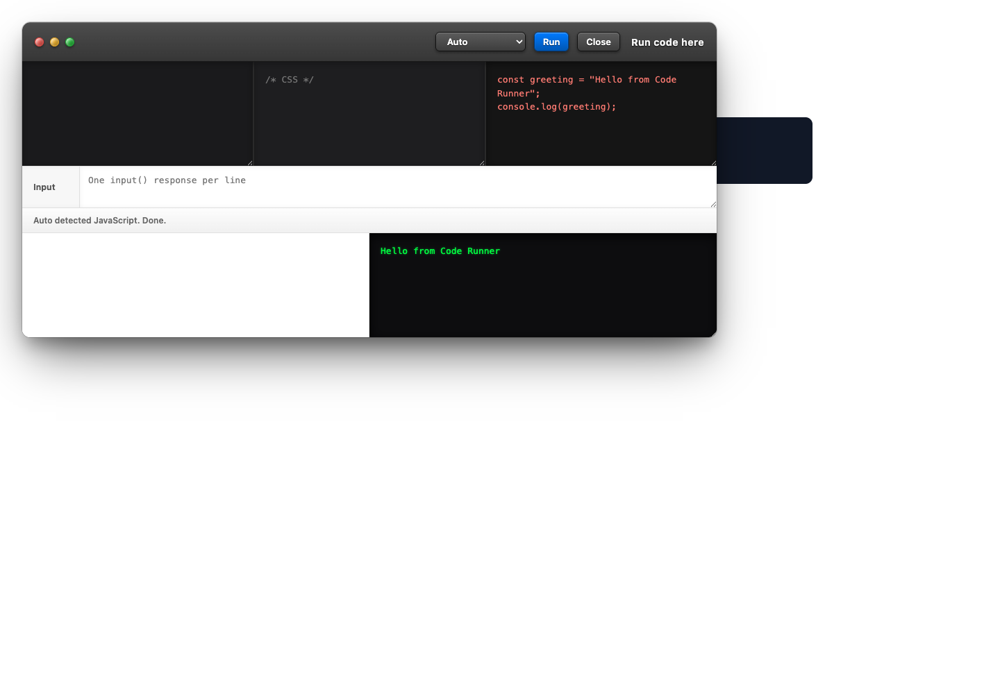
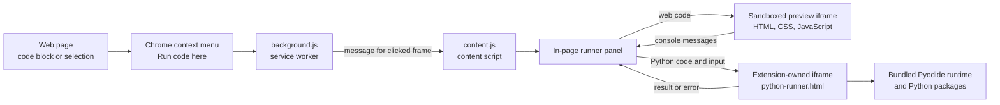
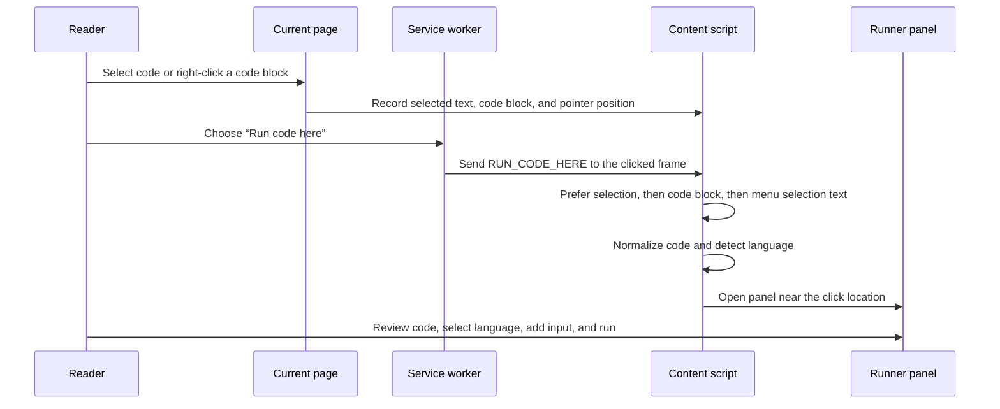
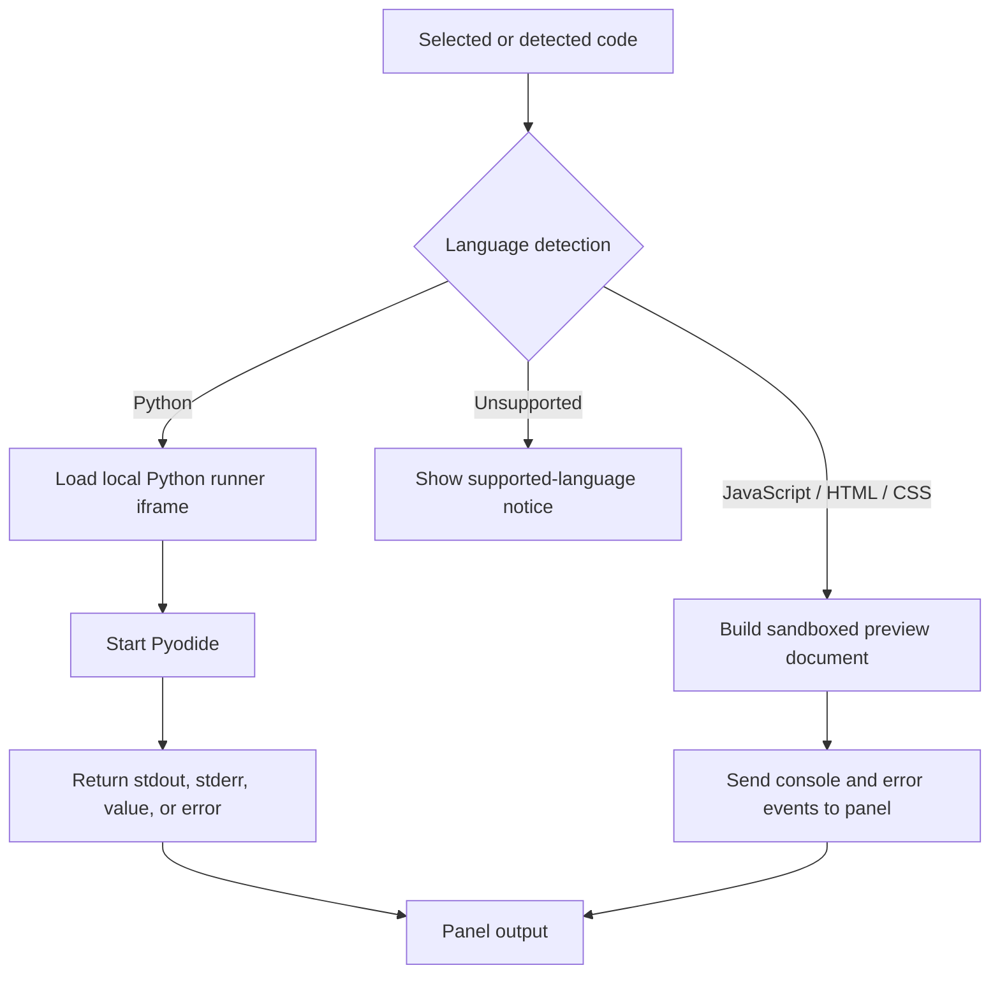

# How Code Runner works

Code Runner brings a small code workspace to the page you are already reading. Its primary workflow is intentionally simple: right-click code on a page, select **Run code here**, adjust the code or language if necessary, and run it in the panel.

The screenshot shows the full panel after running a JavaScript snippet. The code editors, input box, preview pane, and console output stay on the current page.

## Components

| File | Responsibility |
| --- | --- |
| `manifest.json` | Declares the Manifest V3 extension, permissions, content script, service worker, icons, security policy, and extension resources. |
| `background.js` | Creates the **Run code here** context-menu item and sends the command to the exact frame that was clicked. |
| `content.js` | Collects selected or nearby code, detects its language, renders the panel, provides inline run buttons, and routes results back into the page UI. |
| `python-runner.html` / `python-runner.js` | Hosts Python execution away from the page context and communicates with the panel using `postMessage`. |
| `pyodide/` | Bundled WebAssembly Python runtime and package files used for browser-based Python execution. |

## Right-click workflow

The service worker passes the clicked frame ID with its message. This prevents the panel from appearing multiple times when a page contains iframes.

## Language routing

### JavaScript, HTML, and CSS

The panel creates a sandboxed preview iframe. It builds a small document from the HTML, CSS, and JavaScript editors, then adds a console bridge that forwards `log`, `info`, `warn`, errors, and unhandled promise rejections to the panel output. The input box supplies values to `prompt()` before falling back to the browser prompt.

### Python

The panel lazily creates a hidden extension-owned iframe pointing to `python-runner.html`. That iframe loads Pyodide from the packaged `pyodide/` directory. When the user runs Python, the panel sends the code and newline-separated input with `postMessage`; the runner captures stdout and stderr, replaces `input()` with a queue-backed function, executes the code asynchronously, and sends the result or error back.

## Code collection and detection

The content script records both the current text selection and the closest likely code block when the context menu opens. It recognizes `pre`, `code`, and common editor or syntax-highlighting class names. The selection is preferred because it lets a reader run only part of a block.

Language detection uses lightweight pattern matching. It identifies HTML, CSS, JavaScript, and Python, defaults ambiguous snippets to Python, and always lets the user override the choice in the panel.

## Safety and boundaries

- The extension does not create a server-side execution environment; all execution happens in the browser.
- The preview iframe is sandboxed. Python runs in browser WebAssembly, so it cannot access local files, installed operating-system packages, or the host shell.
- Results and errors are displayed in the panel or below an inline code block.
- Use the extension for code you understand. Running code can still change the current page’s content or make network requests within the browser environment.

## Inline run buttons

In addition to the context menu, the content script periodically finds unprocessed `pre` blocks and adds a small run button on hover. This path is intended for quick execution. Use the right-click panel when you need to edit code, select a language explicitly, provide input, or inspect a full preview.
